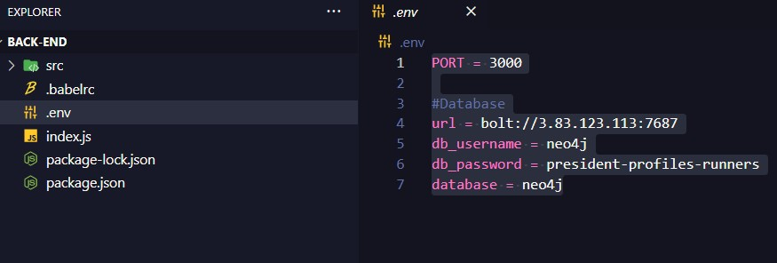
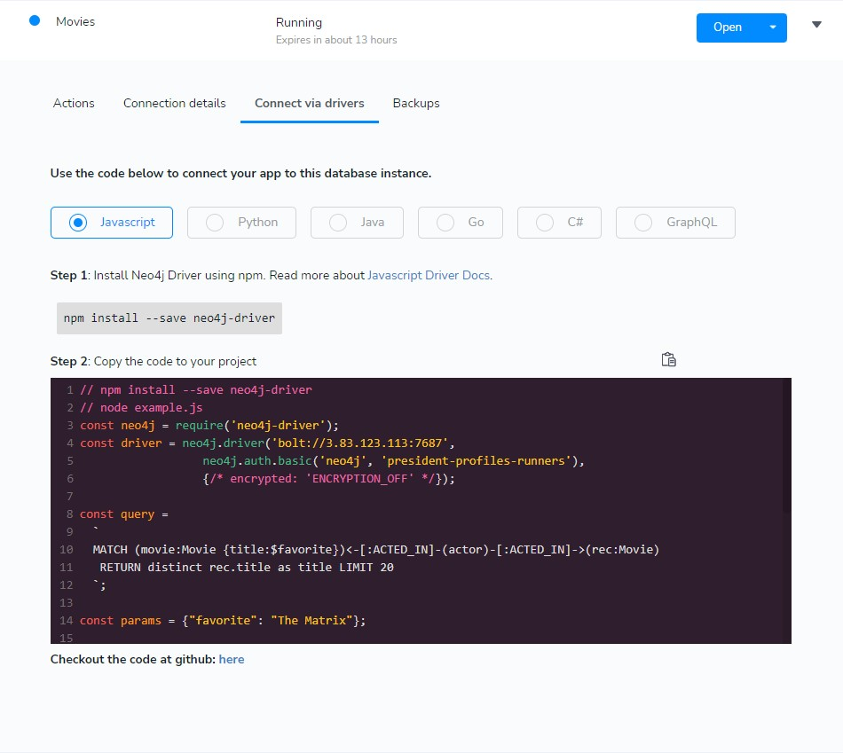

# C.R.U.D._Restify_Neo4J_Vuetify

> Projeto com Vue.js e Vuetify para fins educacionais</a>


<a href="https://github.com/carlosbandelli">

</a>

<a href="#">

</a>

<a href="#">

</a>

<a href="https://github.com/carlosbandelli/Cards/commits/main">

</a>

<div style="margin: 0 auto;">

</div>

<hr/>

## 💡 Sobre o projeto:

Este projeto faz parte de um desafio que consistia em desenvolver  uma aplicação que permitisse ao usuário podesse criar uma novo usuário, vizualizar quantos existem, editar algumas caracteristicas e por final deletar. Sobre a parte técnica do desafio foi requisitado a utilização das seguintes tecnologias. Para Back-end: Node.js, Restify e o banco de dados Neo4J. Para o Front-end foi requisitado as tecnologias Vue.js e Vuetify.js. 

##🔥 Quais são as funcionalidades?

-Iniciamos com uma pagina de painel de usuarios, onde contem todos os usuario que estão gravados no banco de dados.<br/>
-Nesse painel voce pode executar 3 ações distintas, sendo elas: Registar usuario, Editar usuario e Deletar usuario.

## ⚙️ Techs:
### 💾 BACK-END
-Node.js <br/>
-Restify <br/>
-Neo4J (Banco de Dados) <br/>
-Javascript <br/>

### 📺 FRONT-END
-Vue.js <br/>
-Axios <br/>
-Vuetify.js <br/>
-Javascript <br/>

<hr/>

## 😎 Melhorias no Projeto:

#### 💾BACK-END:

-Implementação de validação de email, assim não cadastraria email repetido <br/>
-Componentização da rotas, deixaria a vizualizção da aplicação dinamica <br/>
-Instalação do prettier, para identações do código se tornarem padrão <br/>
-Trocaria javascript por typescript, para se obter uma troca de dados mais assertiva <br/>
-Instalação de autenticação via JWT <br/>
-Instalação da biblioteca Swagger<br/>

#### 📺 FRONT-END:

-Componentização de botões e cards de usuarios <br/>
-Instalação do prettier, para identações do código se tornarem padrão <br/>
-Instalação de jest.js, para teste unitários <br/>


<hr/>

## 🏆 Desafios da aplicação

O maior desafio da aplicação foram as cypher query pois tive que aprender em uma semana como ela funcionavam e com se relacionavam, depois disso a implementação do bacno de dados com a minha api, feito com uma tecnológia que era nova para mim porem semelhante aos que ja usava, depois de criar os models veio a comunicação com o fronte-end onde eu tive dificuldade pois mesmo instalando o cors, as requisições não funcionavam e por fim teve o Vuetify ou tra tecnologia que se assemelha com alguams que ja havia estudado porem era nova para eu fazer uma aplicação.<br/>

As melhorias para o meu conhecimento poderia ser aplicado porem o tempo para mim foi de 7 dias e foquei na tecnologias que eram novas no momento, deixando para traz algumas validações e autenticação.<br/>

Evolui muito fazendo esse projeto pois eram novas as tecnologias  e tive uma curva de aprendizado e resiliencia muito grande, pois pensei em desistir por não ter tempo habil para as devidas boas praticas de uma boa aplicação, mas a superação em realizar um projeto assim foi muito satisfatória.

Chega de conversa vamos para o código!

<hr/>

## ⛏ Ferramentas:

- [Visual Studo Code](https://code.visualstudio.com/download)

## 🏁 Configuração ambiente:

Para executar a aplicação:
Precisa fazer o git clone do projeto<br/>
Fique á vontade para clonar de quaisquer uma das seguintes chaves na sua maquina<br/>

#### Chave SSH:
```bash
 git clone git@github.com:carlosbandelli/C.R.U.D._Restify_Neo4J_Vuetify.git
```

#### Chave HTTPS:
```
git clone https://github.com/carlosbandelli/C.R.U.D._Restify_Neo4J_Vuetify.git
```

Execute em ambas pasta raiz das duas pasta, tanto Back-end quanto Front-End para baixar as dependências:

```
npm install
```
### 💾 BACK-END:

Àpos a instalação iremos a pasta <b>Back-end</b> e criaremos um arquivo chamado <b>.env</b>
Neste arquivo colocaremos as seguinte informações:
```
PORT = 

#Database
url = 
db_username = 
db_password = 
database = 

```
PORT : nesta variavel voce vai colocar que porta voce quer que inicie a sua aplicação <br/>
url: Essa url voce vai pegar do banco de dados ( no caso eu usei Neo4J sandbox, criei um banco de dados nele e ele me forneceu essa url) <br/>
db_username = Voce usa o username do banco de dados ( esse username assim que voce cria um banco de dados Neo4j no mesmo local da url é fornecido o username <br/>
db_password = Tambem é fornecido pelo Neo4j no mesmo local da url <br/>
database = nome do banco de dados que voce criou <br/>

Imagen abaixo para configuração do arquivo <b>.env</b>

<div style="margin: 0 auto;">

</div>

Imagen abaixo para configuração do <b>Banco de dados</b> 

<div style="margin: 0 auto;">

</div>

Neo4J sandbox Link : <a href="https://neo4j.com/sandbox/">
clique aqui
</a>


Feita essas configurações podemos iniciar o BACK-END.<br/>
para iniciar a aplicação execute na src:

```
node index.js
```
ou

```
nodemon index.js
```
### 📺 FRONT-END:
 Nesta parte apos instalar as dependencia vá na pasta raiz e utilize o comando
 
 ```
 npm run serve
 
 ```
 
No terminal ou CMD aparecerá duas portas já aberta e configuradas clique com o botão direito e seu browser padrão vai abrir uma pagina.<br/>

# Ultima parte porem muito importante no FRONT-END, em todas as requisições AXIOS com o metodos POST, GET, DELETE e PUT trocar  o numero da porta do localhost para o numero da porta que voce abriu no BACK-END, pois é da porta aberta no BACK-END que ele fará a requisição.
